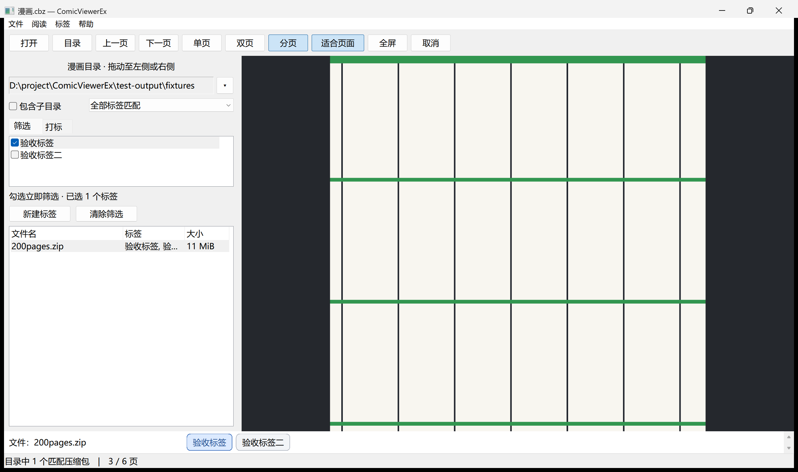

# ComicViewerEx

中文 Windows 原生漫画阅读器，支持直接阅读压缩包、保存常用密码、给压缩包打标签。采用 C++20、Win32、Direct2D/WIC，不需要安装 .NET、浏览器或 7-Zip。

当前版本为 v1.1.0，支持可停靠侧栏、目录下拉、单击与键盘切书、全局阅读偏好，以及独立标签筛选／打标和底部单行标签气泡。

## 下载

- [下载最新便携版](https://github.com/SumomoAkihime/ComicViewerEx/releases/latest)：选择 `ComicViewerEx-1.1.0-win-x64.zip`，解压即可运行。
- [v1.1.0 发布说明与完整源码](https://github.com/SumomoAkihime/ComicViewerEx/releases/tag/v1.1.0)：`ComicViewerEx-1.1.0-source.zip` 附固定版本依赖，`SHA256.json` 提供两个 ZIP 的校验值。
- GitHub 自动生成的 `Source code` 压缩包仅包含仓库文件，构建前需要执行依赖准备脚本。



上图为 v1.1.0 单行标签气泡界面，使用程序生成的测试图片，不附带漫画内容。

## 运行

解压 `ComicViewerEx-1.1.0-win-x64.zip`，运行 `ComicViewerEx.exe`。请完整保留同目录的 `7z.dll` 和 `licenses`。

从旧版升级：退出程序并备份原目录的 `data`，覆盖新版程序和随包文件，保留 `data`。数据库版本不变，已有标签、进度和密码继续保留。

支持 Windows 10/11 x64。设置、标签、阅读进度和**明文密码**保存在程序旁的 `data/library.db`；备份时退出程序并复制整个 `data` 目录。目录必须可写。同一便携目录只运行一个实例。

## 阅读

- 打开 ZIP/CBZ、RAR/CBR、7z 或单张图片，也可以直接拖入。菜单“阅读图片目录”递归阅读目录中的图片。
- JPEG、PNG、WebP、BMP，以及 GIF/TIFF 的静态首帧。按完整条目名称自然排序，例如 `page2` 在 `page10` 前。
- 单页、双页、宽图左右分页；双页遇到横图时单独显示。菜单可切换从右向左阅读。
- 单页／双页／宽图分页、阅读方向与适应方式全局保存，切换漫画或重启不会被各书旧设置覆盖。首次升级从上次阅读漫画的旧设置初始化，没有记录时默认单页、从左向右、适合页面。
- 每本书单独记忆阅读位置、半页位置和缩放倍数；非分页模式忽略半页位置。选择适应方式会将当前缩放倍数重置为 1。
- 单击列表中的压缩包即可阅读，列表获得焦点时按上下键连续切书。Ctrl/Shift 多选只选择文件，供批量打标使用。列表打开漫画后保持目录范围、筛选和焦点。
- 点击画布左半边上一页、右半边下一页，不随阅读方向反转；按住左键移动超过系统拖动阈值后平移，松开不翻页。双击按两次点击处理。
- 加密包先尝试该书上次成功密码和常用密码表；仍不能打开时输入密码。勾选保存后，验证成功才写入密码表。菜单“常用密码表”支持删除和修改；修改需通过当前加密漫画验证。

| 操作 | 快捷键 |
|---|---|
| 打开漫画 / 图片目录 / 浏览漫画目录 | Ctrl+O / Ctrl+D / Ctrl+L |
| 上一页 / 下一页 | ←、PgUp / →、PgDn、空格、滚轮 |
| 列表切换漫画 | 单击条目、↑ / ↓ |
| 单页 / 双页 / 宽图分页 | 1 / 2 / 3 |
| 适合页面 / 宽度 / 高度 / 原始比例 | F / W / H / 0 |
| 放大 / 缩小 | + / −、Ctrl+滚轮 |
| 跳转 / 全屏 | Ctrl+G / F11、画布鼠标中键 |
| 取消读取 / 退出全屏 | Esc |
| 刷新目录 | F5 |

单字母与翻页快捷键在阅读区获得焦点时生效，避免干扰左侧列表选择。全屏仍可使用快捷键。

## 侧栏与目录

- 拖动“漫画目录”标题栏到主窗口左侧或右侧边缘，切换停靠位置；侧栏始终留在主窗口内。
- 拖动侧栏与画布之间的分隔线调整宽度，默认 380 DIP、最小 280 DIP，至少为画布保留 320 DIP；窄侧栏的操作按钮换行。
- 位置与宽度在重启后恢复；全屏隐藏侧栏，退出全屏后恢复。
- 点击当前路径按钮展开目录树；点击目录名称或按 Enter 确认，展开箭头仅展开。Esc 或点击外部关闭，不改变目录。也可继续使用工具栏“目录”按钮选择目录。

## 标签

每个文件可同时关联多个标签，不限制为一个。再次添加只补充标签，移除只影响勾选的标签，不覆盖其他关联。

- **筛选页签**：勾选多个标签即可即时筛选，不需要 Ctrl 或“应用”按钮；支持“全部匹配 / 任一匹配”和“包含子目录”。“清除筛选”只清除筛选条件。
- **打标页签**：先在文件列表选择文件（Ctrl/Shift 可多选），再勾选待操作标签，点击“添加所选标签”或“移除所选标签”。页签会显示选中文件数量，打标勾选不会触发筛选。
- **底部气泡**：优先展示列表所选文件的全部标签；多选时注明数量并展示焦点文件的标签。列表没有选择时显示正在阅读文件的标签。点击气泡切换该标签的筛选状态，已参与筛选的标签高亮，其他筛选条件保留。文件信息与气泡保持单行，标签过多时滚动查看，不再增加高度挤占画布。
- 两个页签保留各自独立的勾选状态；新建标签按钮共用。右键某个标签可重命名或删除，标签气泡同步更新。

标签绑定磁盘卷和文件标识，同卷改名/移动后刷新目录可继续识别；复制或跨卷移动不会自动继承。无法取得稳定文件标识时使用完整路径。不会改写漫画压缩包。

## 资源边界

- 图片内存缓存预算 96 MiB，优先当前页和相邻页，不预载整本漫画或整目录封面。
- 固实 RAR/7z 可能需要从固实块起点重新解码。经过的图片逐张写入上限 512 MiB 的临时缓存；关闭书籍即清理，异常退出遗留文件下次启动清理。可按 Esc 取消。
- 大于 600 万像素的图片按比例缩小解码，状态栏会提示；“原始比例”仍按原始尺寸布局，但细节受解码分辨率限制。大于 1 亿像素或单张图片数据超出内存预算时明确报错。
- 首版不支持嵌套压缩包、分卷、动画播放、图像增强、文件整理和旧 ComicsViewer 数据导入。

## 构建与验证

构建环境：Visual Studio 2022 C++ Build Tools（含 Windows SDK 和 CMake）、Python 3.12+。首次从精简源码准备依赖时，需要本机 7-Zip 展开源码；源码完整包已附必要依赖。

从仓库获取源码：

```powershell
git clone https://github.com/SumomoAkihime/ComicViewerEx.git
cd ComicViewerEx
```

在项目根目录执行：

```powershell
# 源码包已带依赖时可跳过；联网准备固定依赖并校验 SHA-256
python -X utf8 tools/fetch_dependencies.py

# 准备自生成图片与固定来源的 RAR 测试样本
python -X utf8 tests/prepare_fixtures.py

# Release 编译和核心测试
./tools/build.ps1

# 在隔离的 test-output 子目录运行图形界面验收，产生截图与性能 JSON
python -X utf8 tests/gui_acceptance.py
python -X utf8 tests/sidebar_acceptance.py

# 生成便携包、源码包和校验清单
python -X utf8 tools/package.py
```

仅构建不执行测试：`./tools/build.ps1 -SkipTests`。程序位于 `build/Release/ComicViewerEx.exe`。测试生成的数据不进入发布包；不读取“参考”目录的密码。

依赖版本和 SHA-256 见 `third_party/dependencies.lock.json`。实际验证环境、性能口径和未覆盖项目见 `验收报告.md`。

## 性能与兼容性

Windows 11 x64、Ryzen AI 9 HX 370、24 GiB 内存、本地 SSD，Release 构建；阅读样本为 200 页、每页 2000×3000 的 PNG 压缩包。

| 指标 | 本机实测 |
|---|---|
| 启动至可操作 | 首次 538.16 ms；重复启动 403.36–424.30 ms |
| 空闲私有内存 | 37.45 MiB |
| 阅读私有内存 | 160.40 MiB |
| 已缓存翻页 | 48.63–50.48 ms |

以上为 v1.1.0 本机结果：核心测试 4/4、画布／标签界面验收和 200% DPI 下侧栏／列表补充验收通过。启动计时至窗口输入空闲，不包含后台恢复书籍；已测范围与待验收项目见[交互调整检查表](docs/交互调整验收.md)。首次启动未清除系统文件缓存，不能视作严格冷启动；Windows 10 尚未实机验证。固实包首次解码及超大图片不套用以上翻页数据。详见[验收报告](验收报告.md)。

## 项目与反馈

`src` 为程序源码，`tests` 为核心与界面测试，`tools` 为依赖准备、构建和打包脚本。仓库不包含本地数据库、测试输出及参考程序；发布包包含完整 `7z.dll` 和第三方许可，详见[第三方组件说明](THIRD_PARTY.md)。

可通过 [Issues](https://github.com/SumomoAkihime/ComicViewerEx/issues) 反馈问题，请注明系统版本、程序版本、文件格式与复现步骤。不要上传个人密码或 `data/library.db`。
